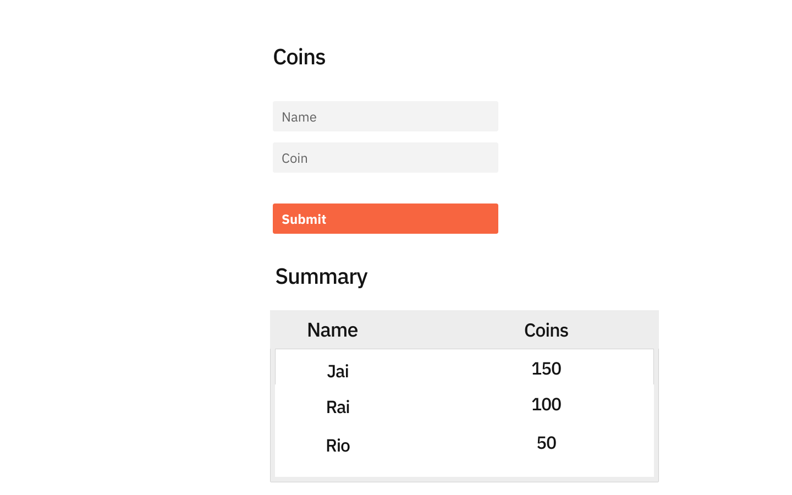

# Exercise
- Develop a 3-Tier application to capture the user coins in the system.

- The Frontend can be either Angular or React.

- The Backend should be Springboot.
    
- The Database is preferably H2 or any other database storage.

# Requirements
- Consider the App will be used by the admin user. (But, there is no authentication/authorization for the exercise)

- Admin can submit coins for a given user. (The user name is free text)

- The name should have minimum length validation of 3 characters.

- The coin is numeric and should be greater than zero.

- The user's coins should be stored in the database table in the append-only approach. 

    Example :
    
    | id   | Name  | Coin |
    | :--- | :---: | ---: |
    | 1    |  Jai  |   50 |
    | 2    |  Rai  |   70 |
    | 3    |  Jai  |  100 |
    | 4    |  Rai  |   30 |


- The summary table in UI aggregate results by user name

    Example :
    | Name  | Coin |
    | :---: | ---: |
    |  Jai  |  150 |
    |  Rai  |  100 |
  

- The summary table should be implemented by reactive rendering. (Either using API polling or observable or WebSocket)

- The summary table should render data submitted from different browser/tabs.

# Front End : React/Angular

The User interface can be designed similar to the below image. (Theming is not mandatory)

- An Entry form to submit coins for a given user.

- A summary table to display cumulative user coins.



# Back End : Spring Boot

Create two rest endpoints as shown below

## API to persist user coins

```json
POST 
    http://localhost:8080/api/coin

Request Body :
    {
        "name": "jai",
        "coin": 50
    }
Response : 201 Success
    {
        "message": "Added 50 coins to 'jai'"
    }
 ```  

## API to retrieve cumulative user coins

```json
GET 
    http://localhost:8080/api/coins

Response : 
    [
       {
            "name": "jai",
            "coin": 100
        },
        {
            "name": "rai",
            "coin": 75
        }
    ]
```